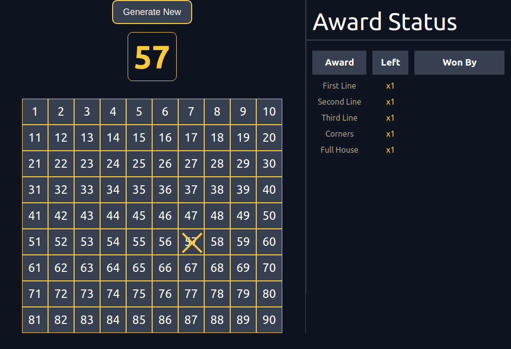
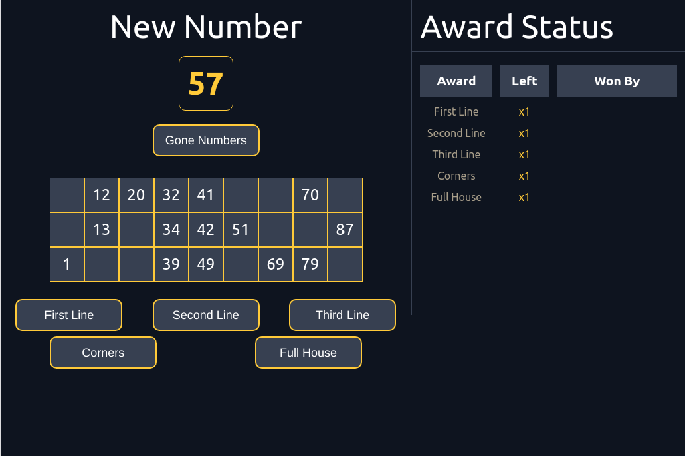

# Online Tambola
This repository holds the source code for online multiplayer version of Tambola/Housie which can be played [here](http://www.tambolakhel.com/).

## Motivation
The motivation behind developing this was to create actual in-person Tambola experience online during this pandemic. All the other mobile versions either do not allow you
to play with your friends or if they do, then those games do not allow for the existence of Host of the game i.e. the person who manages the **Board** and **Awards**.

## Gameplay UI
### Host Screen

### Player Screen

## Contributing
You can contribute by suggesting us a feature or reporting a bug by opening an issue. We do not have any strict guidelines on Contributions. So, feel free to submit issues.

## License
We retain all rights to our source code and no one may reproduce, distribute, or create derivative works from our work.
